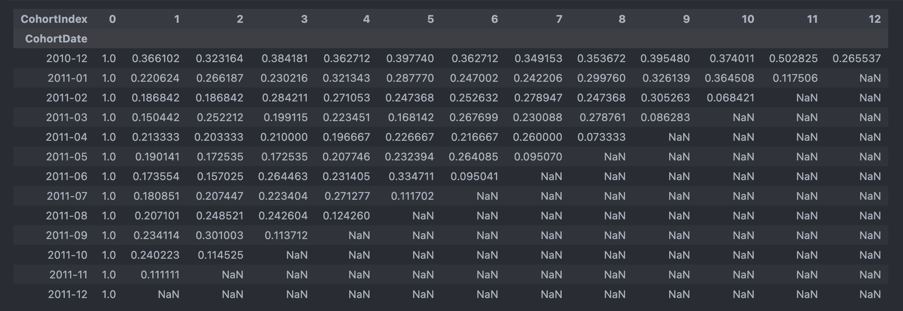
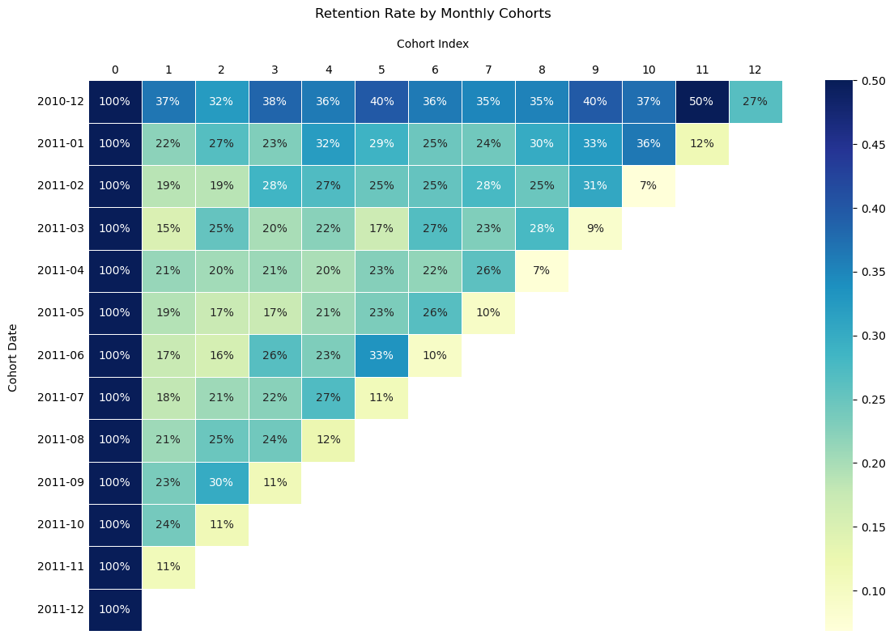
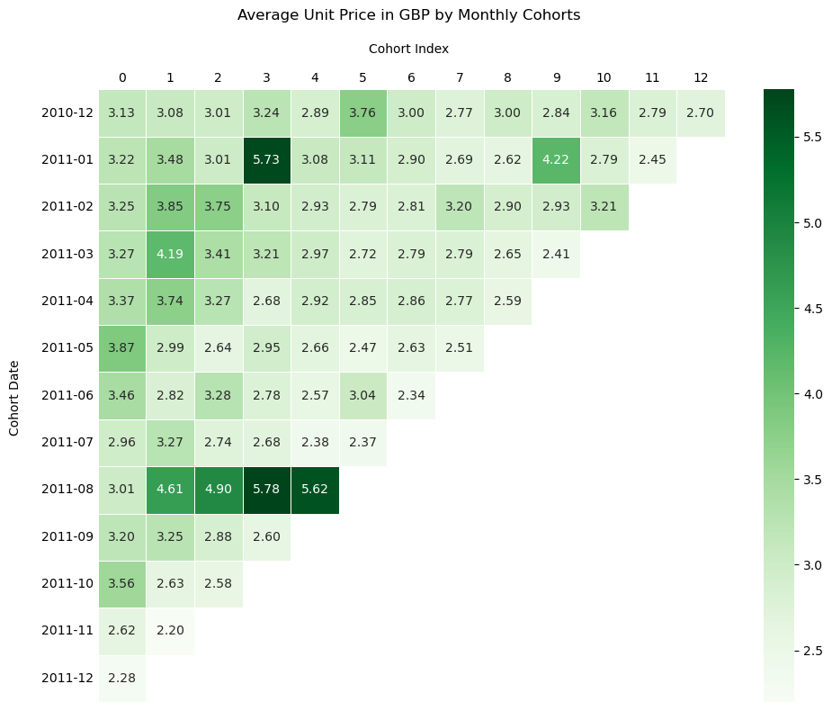
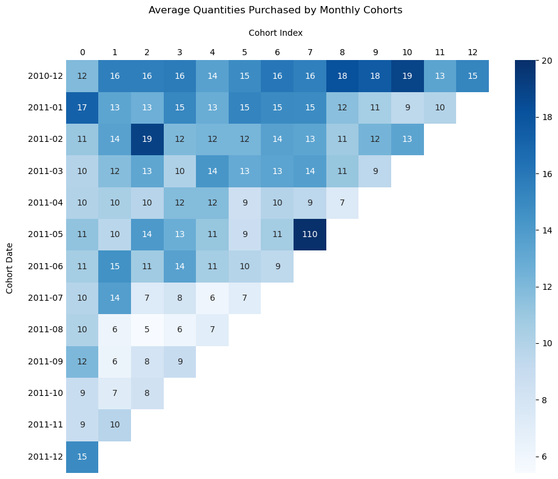

## Introduction
<p>
Have you ever revisited a website throughout the week, added the same few items to your cart, and couldn't bring yourself to buying the product yet? Maybe you frequently purchased products at one store, but decided to shop at another. 
<br>Understanding consumer behavior is integral in creating effective marketing strategies. Cohort Analysis is an analytical method that we can use to help us find patterns by grouping attributes based on shared characteristics.

## What's a Cohort?
Cohort is synonymous to a group with shared traits or characteristics. The grouping criteria can be by demographics, platforms (mobile or desktop), online events, or time of activity. We can analyze differences between cohorts and identify patterns that are not noticeable when looking at the dataset as a whole. <p>
There are two primary types of cohorts:
1. Time-based cohorts considers consumer behavior over a specific period of time, starting from their first interaction with a product or service
2. Segment-based cohorts focuses on specific attributes shared by customers

## Scope of Analysis
I will be performing a <b>time-based cohort analysis</b> on transactional data occurring between 2020-01-12 to 2011-09-12 for a UK based online retailer. The cohort metrics in this analysis are:
1. Retention rate
2. Average price of items purchased
3. Average quantity purchased
<p>
<i>Dataset Source: Chen,Daqing. (2015). Online Retail. UCI Machine Learning Repository. https://doi.org/10.24432/C5BW33.</i>

## Dataset
The dataset contained <b>541,909 rows</b> and <b>8 columns</b> before cleansing and validation. The working dataset has <b>397,924 rows </b> and <b>8 columns</b>. Below are the variables and cleansing activity completed:
|Column|Type|Description|Cleansing|
|------|----|-----------|---------|
|InvoiceNo|Categorical|Unique ID assigned to each transaction. If InvoiceID starts with 'C', then the transaction was cancelled|9,288 cancelled transactions were identified and removed|
|StockCode|Categorical|Unique ID assigned to each product|None|
|Description|Categorical|Product name|1,454 null descriptions were identified and excluded from dataset|
|Quantity|Integer|Quantities of each item per transaction|10,624 rows where quantities <= 0 were identified and removed|
|InvoiceDate|Datetime| Day and time when each transaction was generated|None|
|UnitPrice|Continuous|Product price per unit in GBP|None|
|CustomerID|Categorical|Number uniquely assigned to each customer|135,080 null customer ID's identified and removed|
|Country|Categorical|Name of country where each customer resides|None|

## Cohort Analysis
Performing a time-based cohort analysis can be simplified into three steps:
1. Calulate the cohort date, which is the customer's earliest transaction date. The analysis is focused on months, however the granularity of time is dependent on the business objective.

```python
retail_clean['CohortDate'] = retail_clean.groupby('CustomerID')['InvoiceDate'].transform('min').dt.to_period('M')
```

2. Calculate the cohort index by finding the difference between latest transaction date and the cohort date for each customer.

```python
def cohort_index(df, id, current_date, cohort_date):
    
    # Extract the year and month for InvoiceDate and CohortDate
    current_year, current_month = df[current_date].dt.year, df[current_date].dt.month
    cohort_year, cohort_month = df[cohort_date].dt.year, df[cohort_date].dt.month

    # Calculating the cohort index
    df['CohortIndex'] = (current_year - cohort_year) * 12 + (current_month - cohort_month)
    
    return df
```

3. Identify the cohort metric and aggregate the variable by the cohort date and cohort index.

```python
# Distinct count of customers by each cohort group and index
cohort_summary = cohort_df.groupby(['CohortDate', 'CohortIndex'])['CustomerID'].nunique().reset_index(name = 'Users')

# Calculate the retention rate by dividng the number users for each cohort by the number of users at the beginning of the month
cohort_summary['RetentionRate'] = cohort_summary['Users'] / cohort_summary.groupby('CohortDate')['Users'].transform('max')
```
<p>
In this analysis, I have used heatmaps to visualize activity across cohorts. Before plotting the heatmap, a few insights can be grasped by looking at the pivot table itself:

```python
cohort_pivot = pd.pivot_table(data=cohort_summary, values = 'RetentionRate', index = 'CohortDate', columns = 'CohortIndex')
cohort_pivot
```

* Cohort Date - the cohort group, which is the customer's first invoice date ('2010-12', '2011-01', etc.)
* Cohort Index - the months since the cohort date
    * On the first row, we can read it as "On December 2010, 37% of customers returned one month after their first purchase"
* Each row of the table represents the retention activity of each cohort
* Each cell is the percentage of retained customers for each month 


## Results
Overall, the retention rate for each cohort gradually increases as the months progresses from the customer's initial transaction. The first cohort (December 2010), shows a higher retention rate that is sustained in subsequent months in comparison to other cohorts. The highest retention rate at 50% is observed in the same cohort towards the end of the year. The crticial periods for retention is between March 2011 and July 2011, two months after their first purchase, with March 2011 having the lowest retention rate of 15%. 
<p>



<p>
The average unit price customers spend on products slightly decreases in the subsequent months from their initial purchase. Within the first three months from the cohort date, customers were purchasing higher priced goods, with January 2011 to April 2011 showing the highest concentration of this activity.
<br>
We see anomalies in the October 2011 cohort where customers are purchasing higher priced items after the first purchase. In the January 2011 cohort, specifically the third month after their intial transaction, we see a spike in activity.
<p>



December 2010 to March 2011 shows the highest concentration of customers purchasing more goods than what they intially bought. There's an anomaly in the May 2011 cohort, where an average of 110 units were purchased seven months after their first invoice date. This will definitely require further investigation to see if this data point is valid. We can include other other features, such as 'Country' or 'StockCode' to determine whether there are particular holidays or products on sale.
<p>


